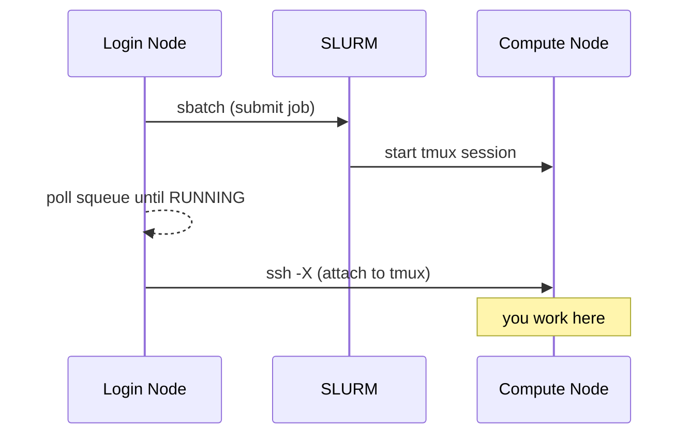

# sinteractive

Persistent interactive sessions on Slurm compute nodes, built on tmux.

**Docs:** <https://rnabioco.github.io/sinteractive/>

`sinteractive` submits a batch job that starts a detached tmux session on the
allocated node, then connects you to it. Because the shell lives in tmux, the
session survives SSH drops and can be reattached later. It is a clean-room
reimplementation inspired by the original `sinteractive` by Pär Andersson
(NSC, Sweden) and the CU Boulder adaptation by Jonathon Anderson, and is
developed for the [Bodhi cluster](https://rnabioco.github.io/bodhi-docs/) at
the RNA Bioscience Initiative — but it is cluster-agnostic: scheduler details
are driven by `SINTERACTIVE_*` environment variables.

## Why use `sinteractive` instead of `srun --pty bash`?

| | `srun --pty bash` | `sinteractive` |
|---|---|---|
| Survives SSH disconnects | No — session is lost | Yes — tmux keeps it alive |
| Multiple terminal panes | No | Yes — tmux split/window support |
| X11 forwarding | Manual setup | Automatic on connect (`ssh -X`) |
| Reconnect to session | Not possible | `sinteractive --attach JOBID` |

> [!TIP]
> Use `srun --pty bash` for quick, throwaway interactive work. Use
> `sinteractive` when you need a session that persists through network
> interruptions or when you want tmux features like split panes.

## Installation

```bash
git clone https://github.com/rnabioco/sinteractive
cd sinteractive
make install
```

As a regular user this copies the script, man page, and bash completion to
`~/.local/bin`, `~/.local/share/man`, and `~/.local/share/bash-completion`
(make sure `~/.local/bin` is on your `$PATH`); as root it installs to
`/usr/local` instead. To install to a different location:

```bash
make install PREFIX=~/bin
```

Requirements: a Slurm cluster, tmux ≥ 3.7 available **on the compute nodes**
(path configurable via `SINTERACTIVE_TMUX`), and SSH access to the nodes for
the initial attach. Admin targets for building tmux and fanning binaries out
to nodes are described under [Deploying on a cluster](#deploying-on-a-cluster).

## Usage

```bash
sinteractive [OPTIONS] [SBATCH_ARGS...]
```

### Options

| Option | Description | Default |
|---|---|---|
| `--node NODE` | Request a specific compute node | any available |
| `--partition PART` | SLURM partition | `interactive` |
| `--time TIME` | Wall time limit (supports `8h`, `30m`, `1d12h`, …) | `1 day` |
| `-j`, `--threads N` | Number of CPUs (alias for `--cpus-per-task`) | `2` |
| `-m`, `--mem SIZE` | Memory | `8G` |
| `-n`, `--name NAME` | Tag the session with a name for easy reattach (`--attach NAME`) | |
| `--mouse` | Enable tmux mouse support (scroll, click panes, drag to resize) | off |
| `--no-mouse` | Disable mouse support (overrides `SINTERACTIVE_MOUSE`) | |
| `--detach` | Launch without attaching; print connection info and return | |
| `--status [TARGET]` | Show session status by JOBID or NAME (state, node, time remaining) | current session |
| `--json` | With `--list`/`--status`/`--detach`: machine-readable JSON output | |
| `-a`, `--attach [TARGET]` | Reattach by JOBID or NAME; with no target, your only session | |
| `--ensure NAME` | Reuse the session named NAME, or launch it if absent (implies `--detach`) | |
| `--cancel TARGET` | Cancel a session by JOBID or NAME | |
| `--agent-context` | Brief a coding agent on the session it is running inside | |
| `--install-claude` | Install the Claude Code skill and hooks into `~/.claude` | |
| `-l`, `--list` | List running sinteractive sessions | |
| `-h`, `--help` | Show help message | |

All other arguments are passed directly to `sbatch`, so you can use any
`sbatch` option. See `man sinteractive` for full documentation.

### Environment variables

Set personal defaults in your `~/.bashrc`; explicit flags always win.

| Variable | Description | Default |
|---|---|---|
| `SINTERACTIVE_TIME` | Default wall time (e.g. `8h`, `2d`) | `1 day` |
| `SINTERACTIVE_PARTITION` | Default partition | `interactive` |
| `SINTERACTIVE_QOS` | Default QOS (`--qos`); needed on schedulers that require one | unset |
| `SINTERACTIVE_CPUS` | Default CPU count | `2` |
| `SINTERACTIVE_MEM` | Default memory (e.g. `16G`) | `8G` |
| `SINTERACTIVE_MOUSE` | `on`/`1`/`true`/`yes` enables mouse support | off |
| `SINTERACTIVE_TMUX` | Path to the `tmux` binary on the compute node | `/usr/local/bin/tmux` |

```bash
# Example: always use mouse mode and a bigger default allocation
export SINTERACTIVE_MOUSE=on
export SINTERACTIVE_MEM=16G
export SINTERACTIVE_CPUS=4
```

### Configuring for other clusters (example: CU Alpine)

The defaults above match Bodhi, but everything scheduler-specific is
overridable. To run on
[CU Boulder's Alpine](https://curc.readthedocs.io/en/latest/clusters/alpine/index.html),
three things differ:

- **tmux path** — Alpine ships tmux as a system package at `/usr/bin/tmux`,
  not the source-built `/usr/local/bin/tmux` Bodhi uses.
- **CPU partition + QOS** — the general-purpose CPU queue is `acpu` (an
  explicit `--qos` is mandatory). `acpu`/`cpu-normal` are the names that take
  effect after Alpine's **2026-08-05** rename of `amilan`/`normal`; both name
  sets are already accepted, so using the new ones now means no change at the
  cutover.
- **name clash on `PATH`** — Alpine already provides an older, `screen`-based
  `sinteractive` in `/usr/local/bin`, which is ahead of `~/.local/bin` on
  `PATH`. An `alias` forces your copy to win.

After `make install`, add this to your `~/.bashrc`:

```bash
# Use the ~/.local/bin copy instead of Alpine's older /usr/local/bin one
alias sinteractive="$HOME/.local/bin/sinteractive"

export SINTERACTIVE_TMUX=/usr/bin/tmux     # Alpine's system tmux
export SINTERACTIVE_PARTITION=acpu         # CPU queue (was 'amilan' pre-2026-08-05)
export SINTERACTIVE_QOS=cpu-normal         # 1-day max walltime; QOS is required on Alpine
```

Then `sinteractive` launches a 1-day CPU session. For a longer run (up to
7 days), override the QOS: `sinteractive --time=2d --qos=cpu-long`. The default
account (`amc-general` for most users) is applied automatically; pass
`--account=<name>` if you need a different allocation.

### Examples

```bash
# Default: 1-day session, 2 CPUs, 8G memory
sinteractive

# Run on a specific node
sinteractive --node compute01

# 2-hour session on the rna partition
sinteractive --time=2:00:00 --partition=rna

# Override default memory and CPUs
sinteractive --mem=16G --cpus-per-task=4

# GPU session
sinteractive --partition=gpu --gpus=1 --mem=16G

# Longer session on the normal partition (up to 3 days)
sinteractive --time=1-12:00:00 --partition=normal
```

## How it works

1. **Submits a batch job** — `sbatch` launches the script itself on a compute node, where it starts a tmux session.
2. **Waits for the job to start** — polls `squeue` every 5 seconds until the job is running, showing why it is pending and Slurm's estimated start time. `Ctrl-C` here cancels the pending job.
3. **Connects via SSH** — once running, it SSHs into the compute node with X11 forwarding (`-X`) and attaches to the tmux session.
4. **Stays alive until you exit** — the SLURM job remains running as long as the tmux session exists. Detaching (`Ctrl-b d`) or losing your SSH connection leaves the job running so you can reconnect. Exiting tmux (`exit`) ends the job.



## Reconnecting after a disconnect

If your SSH connection drops or you intentionally detach (`Ctrl-b d`), the
tmux session **keeps running** on the compute node and your work is safe. To
reconnect from the login node:

```bash
# List your running sessions
sinteractive --list
#   JOBID       NAME                  NODE            PARTITION     ELAPSED     TIMELIMIT   CWD
#   12345       rna-seq               compute01       cpu           01:23:45    1-00:00:00  ~/projects/rna-seq

# Reattach
sinteractive --attach 12345
```

If you have only one session running, a bare `sinteractive --attach` goes
straight to it — no need to look up the job id first. With several running,
it lists them with ready-to-run commands to pick from.

Sessions launched with `-n NAME` can be reattached by name
(`sinteractive --attach NAME`). Forgot to name one? Press `Ctrl-b $` inside
the session to name (or rename) it in place — the new name shows up in the
status bar, `squeue`, `--list`, and works with `--attach NAME`.

> [!IMPORTANT]
> This is the key advantage over `srun --pty bash`: with `srun`, a dropped SSH
> connection kills your session and any running processes. With
> `sinteractive`, you just reconnect and pick up where you left off.

> [!NOTE]
> X11 forwarding is set up on the **initial** connection (`ssh -X`).
> Reattaching with `--attach` reconnects through Slurm (`srun`) rather than a
> new `ssh -X`, so GUI apps launched **after** a reattach won't have a working
> `DISPLAY`. If you need X11, keep the original connection, or start a fresh
> session for GUI work.

## Scripting and agent use

`sinteractive` has a headless mode designed for scripts and coding agents such
as [Claude Code](https://code.claude.com/docs/):

```bash
# Launch without attaching; returns once the session is ready
sinteractive --detach -n mywork --time=8h

# Get-or-create in one idempotent call
sinteractive --ensure mywork --time=8h --json
# {..., "created": true}    launched it
# {..., "created": false}   one was already running

# Machine-readable session info
sinteractive --list --json
sinteractive --status mywork --json
# {"job_id":147845,"name":"mywork","state":"RUNNING","node":"compute20",
#  "partition":"rna","cpus":8,"memory":"32G","memory_mb":32768,"gpus":0,
#  "time_limit":"8:00:00","elapsed":"0:43","end_epoch":1783180952,
#  "remaining_seconds":28757}
```

> [!IMPORTANT]
> **A session is not a compute target.** It is an orchestration shell: the
> default `interactive` partition is the smallest on the cluster, and anything
> heavy you run in the session competes with the shell you are typing in. Run
> work in an allocation sized for it:
>
> ```bash
> # One-off job
> srun -p rna -c 8 --mem 32G -t 1:00:00 -- make test
>
> # Sustained work: hold one allocation and reuse it
> salloc --no-shell -p rna -c 32 --mem 96G -t 4:00:00   # job id on stderr
> srun --overlap --jobid=ID -- cargo build --release
> scancel ID
> ```
>
> Every `SLURM_*` variable is stripped from a session, so tools inside it
> don't believe they are a job step — which also means `srun` and `salloc` run
> from inside a session create their own allocations.

Inside a session, `SINTERACTIVE_JOB_ID` (and `SINTERACTIVE_NAME`, if named)
are exported, and `sinteractive --status` with no argument reports on the
current session. A state file at `~/.cache/sinteractive/JOBID.json` carries
`remaining_seconds`, so tools can poll the time budget without querying the
scheduler; it is removed when the session ends. The end time is re-checked
against Slurm immediately before every write, so `updated_epoch` is when the
whole snapshot was confirmed: if it is more than ~2 minutes old, treat the
file as stale and fall back to `sinteractive --status`. A walltime change made
with `scontrol update JobId=... TimeLimit=...` appears within about 30
seconds, or at once with `sinteractive --refresh`.

In-session renames (`Ctrl-b $`) are reflected in the state file, `--status`,
and new panes, but shells already running keep their original
`SINTERACTIVE_NAME`.

> [!TIP]
> This repo ships a [Claude Code skill](https://code.claude.com/docs/en/skills)
> plus two hooks, for agents that run **inside** a session. The skill teaches
> cluster etiquette; the hooks brief the agent on which session it is in at
> startup, and warn it when the session is running out of wall time.
>
> ```bash
> sinteractive --install-claude   # from any installed copy
> make claude-install             # equivalent, from a checkout
> ```
>
> Both print the `settings.json` block to merge; neither edits the file. The
> assets ship beside the script (`<prefix>/share/sinteractive`), so this works
> on a cluster where an admin installed sinteractive with `make nodes` and you
> never cloned the repo.
>
> `sinteractive --agent-context` prints the briefing by hand, so you can see
> exactly what the agent was told.

## Tips

### Basic tmux commands

| Action | Key |
|---|---|
| Show help popup (job info, keys) | `Ctrl-b h` |
| Detach from session | `Ctrl-b d` |
| Name/rename session (updates squeue and `--attach` name) | `Ctrl-b $` |
| Split pane horizontally | `Ctrl-b "` |
| Split pane vertically | `Ctrl-b %` |
| Switch between panes | `Ctrl-b arrow-key` |

### Scrollback and keyboard copy/paste

Copy mode uses vi keys (forced, regardless of `$EDITOR`), and copied text
lands in your **local** system clipboard over SSH via OSC 52 — usually far
smoother than mouse selection, especially with the scrollbar active.

| Action | Key |
|---|---|
| Enter copy mode (scrollback) | `Ctrl-b [` (press `q` to exit) |
| Move around | arrow keys, `PgUp`/`PgDn`, `g`/`G` for top/bottom |
| Start selection | `Space` (`V` selects whole lines) |
| Copy and exit copy mode | `Enter` (also lands in your local clipboard) |
| Paste into a pane | `Ctrl-b ]` |
| Search up / down | `?` / `/` (then `n`/`N` for next/previous match) |

The same table is available inside a session at any time with `Ctrl-b h`.

> [!TIP]
> Start with `sinteractive --mouse` to scroll with the wheel, click to switch
> panes, and drag borders to resize. Mouse mode captures terminal selection,
> so hold **Shift** when you want to select text for an OS-level copy (tmux's
> own mouse selection is copied out over SSH automatically).

### Cancelling the job

Exiting the tmux session (type `exit` or `Ctrl-d` in all panes) automatically
cancels the SLURM job. You can also cancel it from the login node, by name or
job id:

```bash
sinteractive --cancel myproj
sinteractive --cancel 12345
scancel 12345              # equivalent, job id only
```

Pressing `Ctrl-C` while a launch is still waiting in the queue cancels the
pending job too.

### Waiting for a job to start

When the cluster is busy your job may sit in the queue. While it does,
`sinteractive` shows why it is waiting (Slurm's pend reason — free resources,
higher-priority jobs ahead of you) and, when Slurm can estimate one, the
expected start time:

```
 ⠹ waiting for free resources — est. start 14:32 (2m elapsed)
```

### Tab completion

`make install` installs a bash completion. It completes options, and after
`--attach`, `--status`, and `--cancel` it completes the job ids and names of
your running sessions:

```bash
sinteractive --attach <TAB>
# 12345  rna-seq  12346  assembly
```

Session names are read from the state files in `~/.cache/sinteractive/`, not
from `squeue`, so completion stays instant even when the scheduler is slow.
Start a new shell after installing to pick it up.

## Deploying on a cluster

`sinteractive` runs tmux **on the allocated compute node**, and `/usr/local`
is typically node-local, so the tmux binary (and, for a system-wide install,
the script itself) must exist on every node. The Makefile has root-only admin
targets for this:

```bash
sudo make tmux-deps   # build deps (RHEL/Rocky 9: gcc, libevent-devel, ...)
sudo make tmux        # build tmux from source into /usr/local
sudo make tmux-push   # fan the binary out to every node Slurm knows about
sudo make tmux-all    # build + push

sudo make nodes       # install sinteractive + man page + completion on every node
```

`NODES` defaults to `sinfo -hN -o '%N'`; override with
`make tmux-push NODES="compute00 compute01"`. Pushes copy to a temp name and
rename into place so running sessions aren't disturbed.

## Docs development

The [documentation site](https://rnabioco.github.io/sinteractive/) is built
with [zensical](https://zensical.org) from `docs/` and deploys to GitHub Pages
on every push to `main`. Requires [pixi](https://pixi.sh):

```bash
# Serve docs locally at http://localhost:8000
pixi run docs

# Build the site (strict mode)
pixi run build
```

## License

MIT — see [LICENSE](LICENSE).
