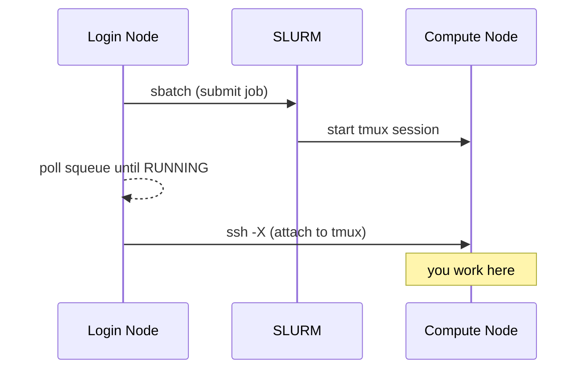

# sinteractive

Persistent interactive sessions on Slurm compute nodes, built on tmux.

`sinteractive` submits a batch job that starts a detached tmux session on the
allocated node, then connects you to it. Because the shell lives in tmux, the
session survives SSH drops and can be reattached later. It is a clean-room
reimplementation inspired by the original `sinteractive` by Pär Andersson
(NSC, Sweden) and the CU Boulder adaptation by Jonathon Anderson, and is
developed for the [Bodhi cluster](https://rnabioco.github.io/bodhi-docs/) at
the RNA Bioscience Initiative — but it is cluster-agnostic: scheduler details
are driven by `SINTERACTIVE_*` environment variables.

## Why use `sinteractive` instead of `srun --pty bash`?

| | `srun --pty bash` | `sinteractive` |
|---|---|---|
| Survives SSH disconnects | No — session is lost | Yes — tmux keeps it alive |
| Multiple terminal panes | No | Yes — tmux split/window support |
| X11 forwarding | Manual setup | Automatic on connect (`ssh -X`) |
| Reconnect to session | Not possible | `sinteractive --attach JOBID` |

!!! tip "When to use which"
    Use `srun --pty bash` for quick, throwaway interactive work. Use
    `sinteractive` when you need a session that persists through network
    interruptions or when you want tmux features like split panes.

## Installation

```bash
git clone https://github.com/rnabioco/sinteractive
cd sinteractive
make install
```

As a regular user this copies the script, man page, and bash completion to
`~/.local/bin`, `~/.local/share/man`, and `~/.local/share/bash-completion` (make sure `~/.local/bin` is on your `$PATH`); as root it
installs to `/usr/local` instead. To install to a different location:

```bash
make install PREFIX=~/bin
```

Requirements: a Slurm cluster, tmux ≥ 3.7 available **on the compute nodes**
(path configurable via `SINTERACTIVE_TMUX`), and SSH access to the nodes for
the initial attach. Admin targets for building tmux and fanning binaries out
to nodes are described in [Deploying on a Cluster](deploy.md).

## How it works

1. **Submits a batch job** — `sbatch` launches the script itself on a compute node, where it starts a tmux session.
2. **Waits for the job to start** — polls `squeue` every 5 seconds until the job is running, showing why it is pending and Slurm's estimated start time. `Ctrl-C` here cancels the pending job.
3. **Connects via SSH** — once running, it SSHs into the compute node with X11 forwarding (`-X`) and attaches to the tmux session.
4. **Stays alive until you exit** — the SLURM job remains running as long as the tmux session exists. Detaching (`Ctrl-b d`) or losing your SSH connection leaves the job running so you can reconnect. Exiting tmux (`exit`) ends the job.



Next: [Usage](usage.md) covers options, environment variables, and
reconnecting; [Scripting & Agents](scripting.md) covers headless/JSON mode.
