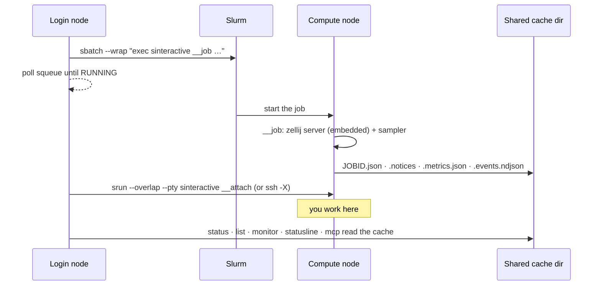

# sinteractive

Persistent interactive sessions on Slurm compute nodes, with
[zellij](https://zellij.dev) compiled in.

`sinteractive` submits a batch job that starts a zellij server on the
allocated node, then connects you to it. Because the shell lives in a
multiplexer, the session survives SSH drops and can be reattached later. It
is one binary: zellij, the status bar, the monitor panel and the Slurm
plumbing are all inside it, so there is nothing to install on the compute
nodes and no multiplexer to find there.

It is also built for coding agents as much as for people. Every reporting
command has a `--json` form, `session peek`/`send` read and drive a session
from the login node, `session events` streams what happens in one, and
`claude install` wires
[Claude Code](https://code.claude.com/docs/) up with skills, hooks, a
statusline and an MCP server — see [Scripting & Agents](scripting.md).

It is a clean-room reimplementation inspired by the original `sinteractive`
by Pär Andersson (NSC, Sweden) and the CU Boulder adaptation by Jonathon
Anderson, developed for the [Bodhi cluster](https://rnabioco.github.io/bodhi-docs/)
at the RNA Bioscience Initiative and for CU Boulder's Alpine — but it is
cluster-agnostic: scheduler details are driven by `SINTERACTIVE_*`
environment variables.

## Why use `sinteractive` instead of `srun --pty bash`?

| | `srun --pty bash` | `sinteractive` |
|---|---|---|
| Survives SSH disconnects | No — session is lost | Yes — the zellij server keeps it alive |
| Reconnect to session | Not possible | `sinteractive attach JOBID\|NAME` |
| Multiple panes | No | Yes — splits, zoom, scrollback (`Ctrl+b`) |
| Mouse and copy | Terminal's own | Mouse on by default; select-to-copy lands in your local clipboard |
| Status bar | None | Job id, node, walltime left, your queue, notices (`⚠ N notices`) |
| Monitor panel | None | `Ctrl+b m`: CPU, memory and GPU bars for every job you can see, in-session; `t` for the full process view |
| Remote read/drive | None | `sinteractive session peek` / `send` from the login node or an agent |
| X11 forwarding | Manual setup | `attach --ssh` (`ssh -X`) |

!!! tip "When to use which"
    Use `srun --pty bash` for quick, throwaway interactive work. Use
    `sinteractive` when you need a session that persists through network
    interruptions, or a place an agent can observe and reach.

## Installation

Download the binary from the
[releases page](https://github.com/rnabioco/sinteractive/releases) (built on
Rocky 8, glibc 2.28, x86_64) and put it on your `PATH`:

```bash
mkdir -p ~/.local/bin
mv sinteractive-x86_64-linux-gnu-glibc2.28 ~/.local/bin/sinteractive
chmod +x ~/.local/bin/sinteractive
sinteractive doctor          # is this install able to run a session from here?
```

Or build from a checkout:

```bash
git clone https://github.com/rnabioco/sinteractive
cd sinteractive
make build      # cargo build --release -p sint --features web_server_capability
make install    # binary, man page, completions and the Claude Code assets
```

As a regular user `make install` copies the binary, man page and shell
completions to `~/.local/bin`, `~/.local/share/man` and
`~/.local/share/{bash-completion,zsh/site-functions}` (make sure
`~/.local/bin` is on your `$PATH`); as root it installs to `/usr/local`
instead. `make install PREFIX=~/bin` picks another location. The binary
itself lands as `.sinteractive-<sha>` beside a `sinteractive` symlink, and
earlier builds stay until no session can be running them — reinstalling
while sessions are up is safe, even on an NFS home where replacing the
executable in place would kill them with SIGBUS.

Building needs a Rust toolchain (`rust-toolchain.toml` pins stable and adds
the `wasm32-wasip1` target, which the status plugin is built for), a C/C++
toolchain with `cmake` and `perl`, and the libcurl and OpenSSL headers. The
binary links glibc and needs `libcurl.so.4` at runtime;
[Deploying on a cluster](deploy.md) covers building on the oldest glibc and
the system-wide install.

Requirements at runtime: a Slurm cluster, and the binary on a filesystem the
compute nodes can see (the batch job execs it from wherever it is installed).
There is nothing to fan out to the nodes. `attach` goes through
`srun --overlap`, so SSH access to the nodes is only needed for
`attach --ssh`, `peek`, `send`, `monitor --live` and `doctor --nodes`.

!!! note "Alpine"
    `/home` is 2 GB and `~/.cache` is where the state files and the
    extracted bundle go by default. Point the cache somewhere with room:
    `export SINTERACTIVE_CACHE=/projects/$USER/.cache/sinteractive`. The
    [Usage](usage.md#configuring-for-alpine-cu-boulder) page has the full
    Alpine profile.

## How it works

1. **Submits a batch job** — `sbatch --wrap "exec sinteractive __job …"`,
   tagged with `Comment=sinteractive[:NAME]` so sessions are found by that
   marker rather than by name. If a maintenance reservation would block the
   request, the walltime is trimmed to end before it, and the session says so.
2. **Waits for the job to start** — polls `squeue`, showing Slurm's pend
   reason and estimated start time. `Ctrl+c` here cancels the pending job.
3. **Starts zellij on the node** — the job body brings up a headless zellij
   server (the embedded one) with every `SLURM_*` variable stripped from the
   session's environment, then runs a sampler that keeps the status bar, the
   state file, the notices, the metrics snapshot and the event log current.
4. **Attaches** — through `srun --overlap --pty` by default, or `ssh -X` with
   `attach --ssh`. Detaching or losing the connection leaves the job running;
   exiting the last shell ends it.



Everything the login-node commands need is read from the shared cache
directory the session writes to, so `status`, `monitor` and the MCP server
cost no SSH and mostly no scheduler queries.
The [deployment page](deploy.md#the-cache-directory) lists the files.

## Maintenance windows

Slurm will not start a job that runs into a maintenance reservation. It defers
it until the window closes, which can be a day or more — so a session asked
for at the default day length simply stops starting as maintenance approaches,
with no obvious reason why.

sinteractive trims the request to fit instead, and says so:

```console
$ sinteractive -n analysis
Maintenance (monthly-maint) starts Thu Aug 27 06:00.
Shortened the request from 24:00:00 to 17:10:43 so the session ends before it.
```

The session then carries its trimmed end time as a notice for its whole life
(`⚠ 1 notice` on the bar, `Ctrl+b n` to read it), so the shortened allocation
stays visible long after the launch output has scrolled away. If less than
10 minutes remains before the window, the launch is refused rather than
handing you a session that dies immediately. An explicit `--reservation` is
left alone — that is you arranging to run inside the window on purpose.

## Migrating from 0.x

- **Subcommands.** `--status`, `--list`, `--attach`, `--ensure`, `--cancel`,
  `--refresh`, `--check-quota`, `--agent-context` and `--install-claude` are
  now `status`, `list`, `attach`, `session ensure`, `cancel`, `status --refresh`,
  `quota --check`, `claude context` and `claude install`. The old flags are
  accepted for one release and warn on stderr.
- **Grouped.** Everything that wires sinteractive into Claude Code lives under
  `claude` (`install`, `context`, `hook`, `statusline`, `mcp`), and the
  generated output under `gen` (`completions`, `man`, `schema`). `refresh`
  became `status --refresh` and `snapshot` became `monitor --once`. Every old
  spelling still resolves; none of them show in `--help`.
- **No tmux.** zellij is compiled in; `SINTERACTIVE_TMUX` is gone and nothing
  needs installing on the compute nodes. Keys are the same `Ctrl+b` chords,
  except that in-session rename (`Ctrl+b $`) is not available yet — name
  sessions at launch with `-n`.
- **Mouse is on by default.** `--no-mouse` or `SINTERACTIVE_MOUSE=off` to
  turn it off.
- **Hooks are native.** `claude install` replaces the `sinteractive-*.sh`
  hook scripts with `sinteractive claude hook …` and also registers the statusline
  and the MCP server.
- **Attach goes through `srun --overlap`** rather than ssh; `attach --ssh` is
  the old path (and the one that forwards X11).
- **The state-file contract is unchanged** (`<cache>/JOBID.json`, same fields,
  same order), so anything that polls it keeps working.

## License

MIT — see [LICENSE](https://github.com/rnabioco/sinteractive/blob/main/LICENSE).
The embedded zellij is MIT-licensed too.
